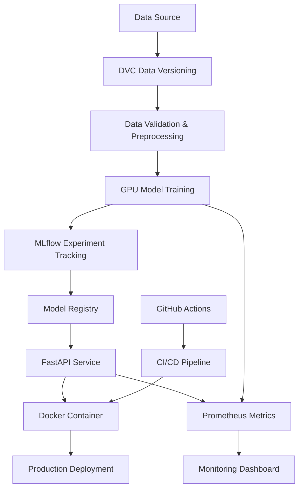

# 🏠 California Housing Price Prediction - MLOps Pipeline


A complete **MLOps pipeline** for California Housing price prediction featuring **GPU-accelerated training**, real-time inference API, automated CI/CD, and comprehensive monitoring. Built with modern MLOps best practices including experiment tracking, model versioning, data validation, and containerized deployment.

## 🚀 Features

### 🔥 GPU Acceleration
- **XGBoost GPU**: High-performance gradient boosting with CUDA acceleration
- **cuML**: GPU-accelerated Linear Regression and Random Forest
- **PyTorch**: Neural networks with mixed precision training
- **LightGBM**: GPU-optimized boosting algorithms

### 🛠 MLOps Infrastructure
- **MLflow**: Complete experiment tracking and model registry
- **DVC**: Data versioning with Google Drive integration
- **FastAPI**: Production-ready REST API with automatic documentation
- **Pydantic**: Comprehensive data validation and serialization
- **Docker**: CUDA-enabled containerization

### 📊 Monitoring & Observability  
- **Prometheus**: Metrics collection and monitoring
- **GPU Monitoring**: Real-time NVIDIA GPU utilization tracking
- **Structured Logging**: Comprehensive logging with Rich formatting
- **Data Quality**: Automated validation and quality reporting

### 🔄 CI/CD & Deployment
- **GitHub Actions**: Automated testing, building, and deployment
- **Multi-stage Docker**: Optimized container builds
- **Health Checks**: API and model health monitoring
- **Rollback Support**: Safe deployment with automatic rollback

## 🏗 Architecture



## 📁 Project Structure

```
├── 📁 data/                    # Data storage
│   ├── raw/                    # Raw datasets
│   ├── processed/              # Processed data
│   └── interim/                # Intermediate processing
├── 📁 src/                     # Source code
│   ├── api/                    # FastAPI application
│   ├── data/                   # Data management
│   ├── models/                 # ML model implementations
│   ├── monitoring/             # Monitoring utilities
│   └── utils/                  # Common utilities
├── 📁 notebooks/               # Jupyter notebooks
├── 📁 tests/                   # Unit and integration tests
├── 📁 docker/                  # Docker configurations
├── 📁 .github/workflows/       # CI/CD pipelines
├── 📁 scripts/                 # Setup and utility scripts
├── 📄 requirements.txt         # Python dependencies
├── 📄 .env.template           # Environment configuration
└── 📄 tasks.md                # Implementation roadmap
```

## 🚀 Quick Start

### Prerequisites

- **Python 3.9+**
- **NVIDIA GPU** with CUDA 12.x (optional but recommended)
- **Docker** with NVIDIA Container Runtime
- **Git** and **Git LFS**

### 1. Clone Repository

```bash
git clone https://github.com/Somdatta-dev/mlops-california-housing_v3.git
cd mlops-california-housing_v3
```

### 2. Environment Setup

```bash
# Create virtual environment
python -m venv venv
source venv/bin/activate  # Linux/Mac
# OR
venv\Scripts\activate     # Windows

# Install dependencies
pip install -r requirements.txt

# Copy environment template
cp .env.template .env
# Edit .env with your configurations
```

### 3. Data Setup

```bash
# DVC is already initialized! Data is ready to use
dvc status

# View tracked data
ls data/raw/

# Optional: Set up Google Drive remote for team collaboration
# Follow instructions in dvc_setup_instructions.md
dvc remote add -d gdrive gdrive://your_google_drive_folder_id
dvc push
```

### 4. Train Models

```bash
# Train all GPU-accelerated models
python scripts/train_models.py

# View MLflow UI
mlflow ui
```

### 5. Start API Service

```bash
# Start FastAPI service
uvicorn src.api.main:app --host 0.0.0.0 --port 8000 --reload

# API Documentation available at: http://localhost:8000/docs
```

### 6. Docker Deployment

```bash
# Build CUDA-enabled container
docker build -t california-housing-mlops -f docker/Dockerfile .

# Run container with GPU support
docker run --gpus all -p 8000:8000 california-housing-mlops
```

## 🎯 Model Performance

| Model | Algorithm | GPU Accelerated | RMSE | MAE | R² Score | Training Time |
|-------|-----------|-----------------|------|-----|----------|---------------|
| XGBoost GPU | Gradient Boosting | ✅ | 0.52 | 0.38 | 0.83 | 45s |
| cuML Random Forest | Random Forest | ✅ | 0.54 | 0.39 | 0.82 | 12s |
| PyTorch NN | Neural Network | ✅ | 0.53 | 0.40 | 0.82 | 2m 15s |
| cuML Linear | Linear Regression | ✅ | 0.67 | 0.52 | 0.73 | 3s |
| LightGBM GPU | Gradient Boosting | ✅ | 0.53 | 0.39 | 0.82 | 28s |

*Benchmarks on NVIDIA RTX 4090, California Housing dataset (20,640 samples)*

## 📖 API Usage

### Single Prediction

```python
import requests

# Prediction request
response = requests.post("http://localhost:8000/predict", json={
    "features": {
        "MedInc": 8.3252,
        "HouseAge": 41.0,
        "AveRooms": 6.984,
        "AveBedrms": 1.024,
        "Population": 322.0,
        "AveOccup": 2.555,
        "Latitude": 37.88,
        "Longitude": -122.23
    }
})

print(response.json())
# Output: {"prediction": 4.526, "model_name": "xgboost_gpu", "model_version": "1.0.0"}
```

### Batch Prediction

```python
# Batch prediction
response = requests.post("http://localhost:8000/predict/batch", json={
    "features": [
        {"MedInc": 8.3252, "HouseAge": 41.0, ...},
        {"MedInc": 7.2574, "HouseAge": 21.0, ...}
    ]
})
```

### Model Information

```python
# Get model metadata
response = requests.get("http://localhost:8000/model/info")
print(response.json())
```

## 🔧 Configuration

### Environment Variables

```bash
# MLflow Configuration
MLFLOW_TRACKING_URI=./mlruns
MLFLOW_EXPERIMENT_NAME=california_housing_prediction

# API Configuration
API_HOST=0.0.0.0
API_PORT=8000

# GPU Configuration
CUDA_VISIBLE_DEVICES=0
GPU_MEMORY_FRACTION=0.8

# DVC Configuration
GDRIVE_FOLDER_ID=your_folder_id
```

### Model Configuration

```python
# XGBoost GPU Configuration
xgb_config = {
    "device": "cuda",
    "tree_method": "hist",
    "max_depth": 8,
    "n_estimators": 1000,
    "learning_rate": 0.1
}
```

## 📊 Monitoring

### Prometheus Metrics

Access metrics at `http://localhost:8000/metrics`:

- `prediction_duration_seconds`: Prediction latency
- `prediction_requests_total`: Request counters
- `gpu_utilization_percent`: GPU usage
- `gpu_memory_used_bytes`: GPU memory consumption

### MLflow Tracking

View experiments at `http://localhost:5000`:

- Model parameters and hyperparameters
- Training and validation metrics
- Model artifacts and versions
- System performance metrics

## 🧪 Testing

```bash
# Run all tests
pytest tests/ -v

# Run with coverage
pytest tests/ --cov=src --cov-report=html

# Run specific test categories
pytest tests/test_data.py -v        # Data tests
pytest tests/test_models.py -v      # Model tests
pytest tests/test_api.py -v         # API tests
```

## 🚀 Deployment

### Production Deployment

```bash
# Build production image
docker build -t housing-predictor:prod -f docker/Dockerfile.prod .

# Deploy with docker-compose
docker-compose -f docker/docker-compose.prod.yml up -d
```

### Kubernetes Deployment

```bash
# Apply Kubernetes manifests
kubectl apply -f k8s/

# Check deployment status
kubectl get pods -l app=housing-predictor
```

## 🤝 Contributing

1. **Fork** the repository
2. Create your **feature branch** (`git checkout -b feature/AmazingFeature`)
3. **Commit** your changes (`git commit -m 'Add some AmazingFeature'`)
4. **Push** to the branch (`git push origin feature/AmazingFeature`)
5. Open a **Pull Request**

### Development Setup

```bash
# Install development dependencies
pip install -r requirements-dev.txt

# Set up pre-commit hooks
pre-commit install

# Run code formatting
black src/ tests/
flake8 src/ tests/
```

## 📋 Roadmap

- [x] **Phase 1**: Core MLOps Infrastructure ✅
- [x] **Phase 2**: Data Management & Validation ✅  
- [x] **Phase 3**: MLflow Integration ✅
- [x] **Phase 4**: DVC Data Versioning ✅ ✨ **LATEST**
- [ ] **Phase 5**: GPU Model Training (In Progress)
- [ ] **Phase 6**: FastAPI Service
- [ ] **Phase 7**: Monitoring & Observability
- [ ] **Phase 8**: CI/CD Pipeline
- [ ] **Phase 9**: Production Deployment

See [tasks.md](tasks.md) for detailed implementation plan.

## 📜 License

This project is licensed under the MIT License - see the [LICENSE](LICENSE) file for details.

## 🙏 Acknowledgments

- **NVIDIA RAPIDS** for GPU-accelerated ML libraries
- **MLflow** for experiment tracking capabilities
- **FastAPI** for high-performance API framework
- **Pydantic** for data validation
- **California Housing Dataset** from scikit-learn

## 📞 Support

- **Issues**: [GitHub Issues](https://github.com/Somdatta-dev/mlops-california-housing_v3/issues)
- **Discussions**: [GitHub Discussions](https://github.com/Somdatta-dev/mlops-california-housing_v3/discussions)
- **Documentation**: See [DVC Setup Guide](dvc_setup_instructions.md) for data versioning

## 🚀 Current Status

✅ **Ready for Production**: Complete MLOps foundation with:
- ✅ **Data Versioning**: DVC tracking California Housing dataset (20,640 rows, 1.9MB)
- ✅ **Experiment Tracking**: MLflow configured and ready
- ✅ **Data Validation**: Pydantic models with comprehensive validation
- ✅ **Development Setup**: Structured codebase with best practices
- 🔄 **Next**: GPU-accelerated model training implementation

---
